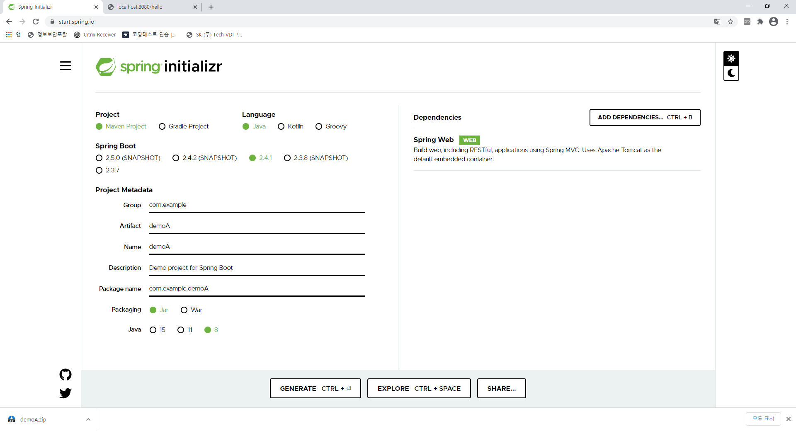
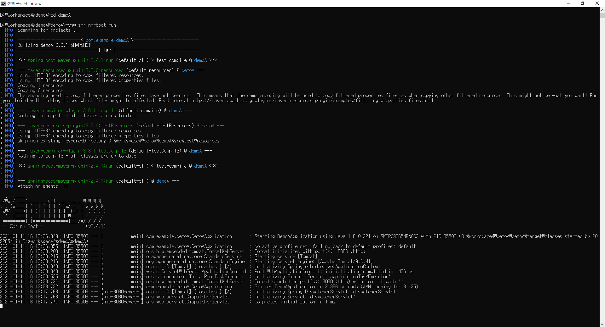
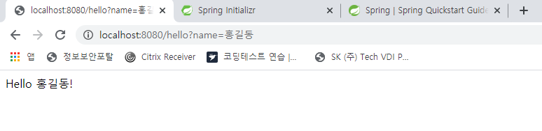

# azure_msa_demo   
Cloud base MSA환경구성

# 목표
1) 클라우드 PaaS - Kubernetis 환경 구성
2) 1번의 환경에 대한 Apache Skywalking 모니터링 툴 적용

# 활용기술
   - Spring Boot
   - Docker
   - Kubernetis
   - Azure - AKS [Azure Kubernetis Service]
   - Azure - MariaDB [PaaS]

# 목차
1) Simple Spring Boot 프로젝트 생성
2) MariaDB와 연동하는 Simple Spring Boot 프로젝트 생성
3) Spring Boot App.을 Docker를 활용하여 이미지화
4) 2개의 Docker이미지를 Kubernetis환경에 배포
5) 1~4번의 과정을 Azure Platform 상에서 진행

## 1) Simple Spring Boot 프로젝트 생성
[참고 : https://spring.io/quickstart]

### 1-1. https://start.spring.io/ 접속
   * 아래와 같이 설정 후 GENERATE 클릭
   

### 1-2. demoA프로젝트를 Eclipse workspace에 압축해제 후 import

### 1-3. demoA프로젝트 샘플 소스코드 수정

	package com.example.demo;
	
	import org.springframework.boot.SpringApplication;
	import org.springframework.boot.autoconfigure.SpringBootApplication;
	import org.springframework.web.bind.annotation.GetMapping;
	import org.springframework.web.bind.annotation.RequestParam;
	import org.springframework.web.bind.annotation.RestController;
	
	@SpringBootApplication
	@RestController
	public class DemoApplication {
		
		public static void main(String[] args) {
			SpringApplication.run(DemoApplication.class, args);
		}
		
		@GetMapping("/hello")
			public String hello(@RequestParam(value = "name", defaultValue = "World") String name) {
			return String.format("Hello %s!", name);
		}
	}

### 1-4. demoA프로젝트 실행 및 확인
   * cmd 창으로 프로젝트 디렉토리로 이동
   * 명령어 실행
   
   	mvnw spring-boot:run
	
   * 웹을 통해 프로그램 확인 :
       
   
   

## 2) MariaDB와 연동하는 Simple Spring Boot 프로젝트 생성

### 2-1. 로컬 Window - MariaDB 설치
   * 아래와 같이 설정 후 GENERATE 클릭

### 2-2. https://start.spring.io/ 접속
   * 아래와 같이 설정 후 GENERATE 클릭
   

### 2-3. demoB 샘플소스 수정

https://spring.io/guides/gs/spring-boot-docker/
mvnw package && java -jar target/demoA-0.0.1-SNAPSHOT.jar
docker build -t demo:1.0 .
docker run -p 8080:8080 demo:1.0

도커 허브에 이미지를 올리고 싶으면, 이미지tag명을 아래의 형식으로 해야 한다.
-- docker hub 계정명 : flghdud1234
-- docker hub Repo명 :msa_test
-- docker build -t flghdud1234/msa_test:demo .
-- docker push flghdud1234/msa_test:demo
$ docker tag first-image (Docker Hub 계정)/docker-repo:first-image
$ docker push (Docker Hub 계정)/docker-repo:first-image

https://www.44bits.io/ko/post/easy-deploy-with-docker

appadmin 임시!@#$1234
[os진단은 이미지를 무엇을 선택하느냐에 따라 success/fail 갈림, rogue wave centos 7.5는 ok]
centos 8.0 fail

https://docs.docker.com/engine/install/centos/

-- sudo yum install -y yum-utils
-- sudo yum-config-manager \
    --add-repo \
    https://download.docker.com/linux/centos/docker-ce.repo
   
-- sudo yum install docker-ce docker-ce-cli containerd.io
-- sudo systemctl start docker
-- sudo docker run hello-world

-- sudo docker pull flghdud1234/msa_test:demo
-- sudo docker run flghdud1234/msa_test:demo
