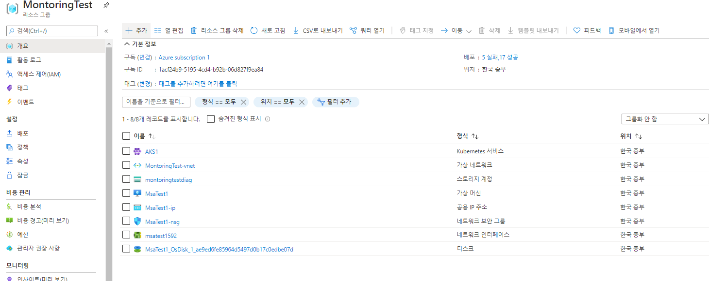

# azure_msa_demo   
Cloud base MSA환경구성

# 목표
1) 클라우드 PaaS - Kubernetis 환경 구성
2) 1번의 환경에 대한 Apache Skywalking 모니터링 툴 적용

# 활용기술
   - Spring Boot
   - Docker
   - Kubernetis
   - Azure - AKS [Azure Kubernetis Service]
   - Azure - MariaDB [PaaS]

# 목차
1) Simple Spring Boot 프로젝트 생성
2) MariaDB와 연동하는 Simple Spring Boot 프로젝트 생성
3) Spring Boot App.을 Docker를 활용하여 이미지화
4) 2개의 Docker이미지를 Kubernetis환경에 배포
5) 1~4번의 과정을 Azure Platform 상에서 진행

## 1) Simple Spring Boot 프로젝트 생성
[참고 : https://spring.io/quickstart]

### 1-1. https://start.spring.io/ 접속
   * 아래와 같이 설정 후 GENERATE 클릭
   

### 1-2. demoA프로젝트를 Eclipse workspace에 압축해제 후 import

### 1-3. demoA프로젝트 샘플 소스코드 수정

	package com.example.demo;
	
	import org.springframework.boot.SpringApplication;
	import org.springframework.boot.autoconfigure.SpringBootApplication;
	import org.springframework.web.bind.annotation.GetMapping;
	import org.springframework.web.bind.annotation.RequestParam;
	import org.springframework.web.bind.annotation.RestController;
	
	@SpringBootApplication
	@RestController
	public class DemoApplication {
		
		public static void main(String[] args) {
			SpringApplication.run(DemoApplication.class, args);
		}
		
		@GetMapping("/hello")
			public String hello(@RequestParam(value = "name", defaultValue = "World") String name) {
			return String.format("Hello %s!", name);
		}
	}

### 1-4. demoA프로젝트 실행 및 확인
   * cmd 창으로 프로젝트 디렉토리로 이동
   * 명령어 실행
   
   	mvnw spring-boot:run
	
   * 웹을 통해 프로그램 확인 :
       
   
   

## 2) MariaDB와 연동하는 Simple Spring Boot 프로젝트 생성

### 2-1. 로컬 Window - MariaDB 설치
   * 아래와 같이 설정 후 GENERATE 클릭

### 2-2. https://start.spring.io/ 접속
   * 아래와 같이 설정 후 GENERATE 클릭
   

### 2-3. demoB 샘플소스 수정

## 3) Spring Boot App.을 Docker를 활용하여 이미지화

### 3-1. Local환경에 Docker Desktop 설치

### 3-2. Docker hub 계정 생성 및 Repo생성

   * 아래의 경우 flghdud1234계정에 mas_test라는 Repository를 생성한 결과이다.
   

### 3-3. SpringBoot Sample 프로젝트를 docker 이미지화
[참고: https://spring.io/guides/gs/spring-boot-docker/]

   * 프로젝트 root에 DockerFile을 하나 만들고 가이드에 나오는 text 복사
   * cmd창을 통해 project root 이동
   * 아래의 명령어를 순차적으로 실행
   
   	mvnw package && java -jar target/demoA-0.0.1-SNAPSHOT.jar 	//빌드 후 테스트 실행
	docker build -t demo:1.0 .					//docker 이미지화 [태그명 + DockerFile 경로]
	docker run -p 8080:8080 demo:1.0				//docker 이미지 demo:1.0 실행

   * SpringBoot를 통해 실행했던 것과 동일한 결과를 Docker image를 실행하여 얻을 수 있다.
   * 빌드된 이미지와 Running 이미지는 Docker Desktop UI를 통해 확인할 수 있다.
   
### 3-4. Push Local image to Docker Hub

   * Docker Hub에 이미지를 올리고 싶을 경우, 이미지명 형식을 Docker Hub와 맞춰 주어야 한다.
   * 이미지명의 형식은 [Doker Hub계정]/[Docker Hub Repo]:[태그명]
   	
	docker build -t flghdud1234/msa_test:demo .
	docker push flghdud1234/msa_test:demo
   
   * Docker Hub에 업로드한 이미지는 Docker Hub 웹사이트를 통해서도 확인할 수 있다.
   	

## 4) 2개의 Docker이미지를 Kubernetis환경에 배포
[참고 : 시간 문제로 Azure에서 제공하는 예시 프로그램을 배포함]

### 4-1. Azure Kubernetis Service Object 생성

   * Azure Kubernetis 서비스를 생성한다. [PaaS]
   
   * 노드 크기의 Default값은 3이지만 1로 설정이 가능하다.
   
   
   * 나머지 설정들은 모두 Default 설정값을 그대로 적용하였다.
   	
   	
   	

   * 생성이 완료되면 target ResourceGroup에 AKS1 Object 1개가 생성되지만, AKS1 Platform의 기반이 되는 자원들은 별도 ResouceGroup으로 생성된다.
   
   

### 4-2. AKS에 샘플 서비스 배포

   * AKS는 기본적으로 kubectl을 통해 제어가 되며, 아래의 방법으로 kubectl 환경으로 들어간다.
       [AKS object 클릭 -> 연결 버튼 클릭 -> 표시되는 Guide에 맞춰 Azure Cloud Shell 입력]
       [아래의 화면과 같이 kubectl 명령어를 활용할 수 있는 환경에 접속할 수 있다.]
       [최초 세팅 이후부터는 Cloud Shell에 접속하자마자 kubectl 명령어를 사용할 수 있다.]
     
   

   * Shell환경에서 yaml파일을 작성하여 배포도 가능하지만, Azure Portal에서도 yaml파일을 추가할 수 있다.
       [AKS object 클릭 -> +추가 버튼 클릭 -> Sample YAML파일 복사 -> 추가 버튼 클릭]
       [YAML샘플 : https://docs.microsoft.com/ko-kr/azure/aks/kubernetes-walkthrough-portal?WT.mc_id=Portal-Microsoft_Azure_Marketplace]
   
   
   
   * Cloud Shell을 통해 서비스 확인
       [azure-vote-front 서비스의 EXTERNAL-IP값이 정상적으로 출력되면 정상이지 않을까?]

	kubectl get service azure-vote-front --watch
	
   * 배포한 서비스 확인

   

https://www.44bits.io/ko/post/easy-deploy-with-docker

appadmin 임시!@#$1234
[os진단은 이미지를 무엇을 선택하느냐에 따라 success/fail 갈림, rogue wave centos 7.5는 ok]
centos 8.0 fail

https://docs.docker.com/engine/install/centos/

-- sudo yum install -y yum-utils
-- sudo yum-config-manager \
    --add-repo \
    https://download.docker.com/linux/centos/docker-ce.repo
   
-- sudo yum install docker-ce docker-ce-cli containerd.io
-- sudo systemctl start docker
-- sudo docker run hello-world

-- sudo docker pull flghdud1234/msa_test:demo
-- sudo docker run -p 8080:8080 flghdud1234/msa_test:demo

-- docker images [로컬에 받아진 images]
-- docker ps [실행중인 container]

https://kubernetes.io/ko/docs/tutorials/stateless-application/guestbook/

https://training.play-with-kubernetes.com/kubernetes-workshop/

https://docs.microsoft.com/ko-kr/azure/aks/kubernetes-walkthrough-portal?WT.mc_id=Portal-Microsoft_Azure_Marketplace

